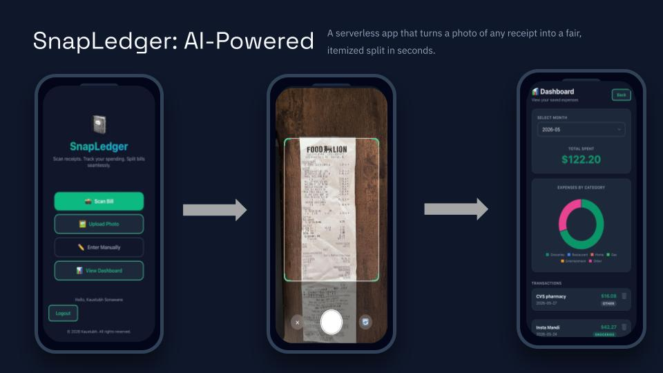

# 📓 SnapLedger

**Scan receipts. Track your spending. Split bills seamlessly.**

SnapLedger is a modern, serverless Progressive Web App (PWA) that serves as your all-in-one financial companion. Whether you are tracking your personal monthly expenses in a secure, cloud-synced dashboard or splitting a complex dinner bill with friends, SnapLedger handles the math for you. No downloads required.

---

## ✨ Features

### 📊 Personal Finance Tracking
- **Google Authentication** — Securely log in to lock down your personal data.
- **Cloud Sync** — Powered by Firebase Firestore. Access your expense dashboard from any device.
- **Smart Categorization** — Tag receipts (Groceries, Dining, Gas, etc.) to track your spending habits.
- **Enterprise-Grade Security** — Strict database rules ensure only *you* can read or write your data.

### ✂️ Group Bill Splitting
- **AI-Powered OCR** — Automatically reads item names and prices directly from your receipt.
- **Proportional Math** — Accurately distributes tax and tip based on what each person ordered.
- **Payment Links** — Generate one-tap Venmo, PayPal, and Cash App request links.
- **Frictionless Sharing** — Send the final split to your friends via text or copy-to-clipboard.

### 📱 Built for the Modern Web
- **Installable PWA** — Add it to your iOS or Android home screen for a native app experience.
- **Mobile-First Design** — Fluid, responsive UI that works beautifully on any screen size.
- **Dark Mode** — Automatically matches your system preferences to save your eyes (and battery).

---

## 🚀 How It Works

### Flow 1: Track Your Own Spending
1. **Log In:** Authenticate with Google to access your private dashboard.
2. **Scan:** Snap a photo of your receipt or enter the total manually.
3. **Save:** Categorize the expense and instantly sync it to your cloud database.

### Flow 2: Split a Bill with Friends
1. 📸 **Scan:** Upload a photo of your bill or use your camera.
2. 📝 **Review:** Edit the AI-detected items and prices if needed.
3. 👥 **Add People:** Enter the names of everyone splitting the bill.
4. 🍽️ **Assign:** Tap to assign who had what.
5. 💰 **Tax & Tip:** Let SnapLedger calculate the proportional tax and tip for each person.
6. 📤 **Share:** Send the final split or pay instantly via direct payment links.

---

## 🛠️ Tech Stack
- **Frontend:** HTML5, CSS3, Vanilla JavaScript (ES Modules)
- **Backend/Database:** Firebase v10 (Cloud Firestore)
- **Authentication:** Firebase Auth (Google Provider)
- **Hosting & CI/CD:** Netlify